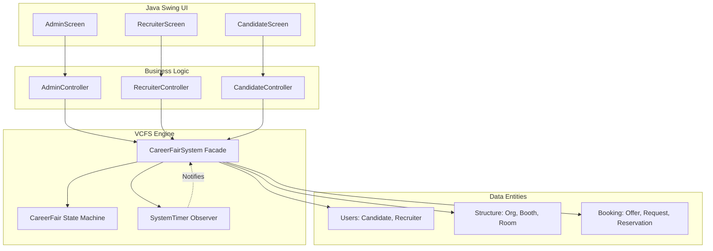
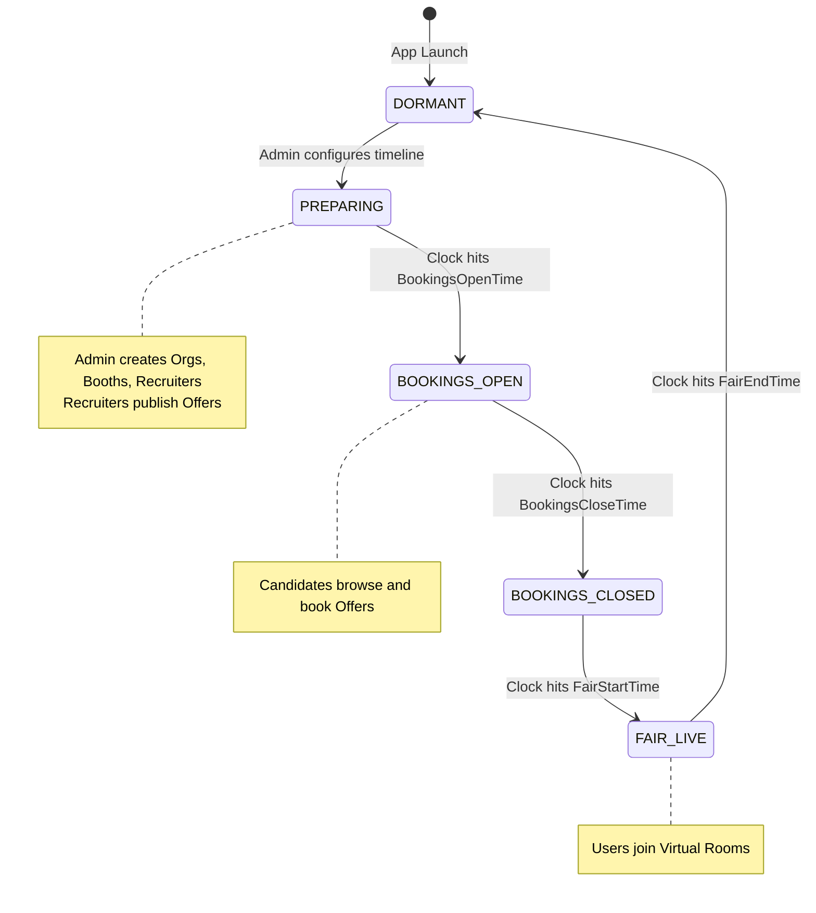
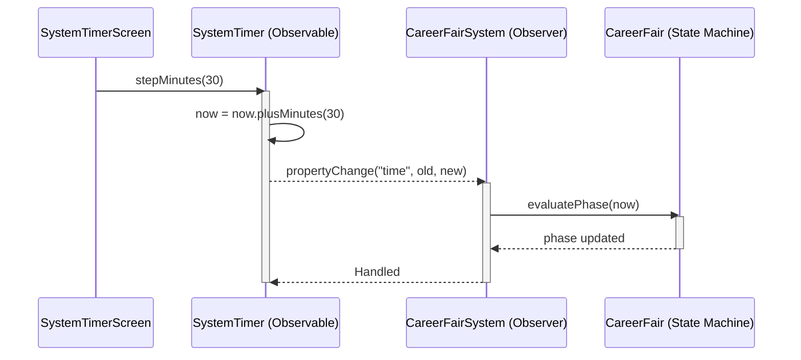
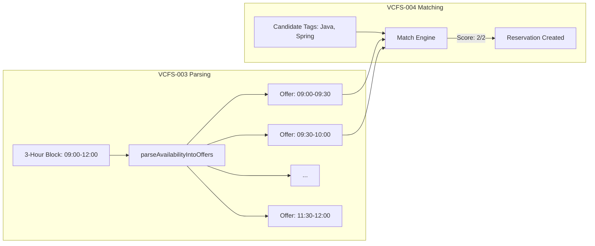

# Virtual Career Fair System (VCFS)
**Group 9 - CSCU9P6**

## Project Leadership & Architecture
**Project Manager & Lead Developer:** Zaid Siddiqui  
**Collaborators:** Taha, YAMI, MJAMishkat, Mohamed

---

## 🏗️ System Architecture Overview

The VCFS application is built upon an **Enterprise-Grade Java Architecture** utilizing strict **Model-View-Controller (MVC)** separation, the **Observer Pattern**, and a robust **State Machine**.

### 1. High-Level MVC Flow


### 2. The Core State Machine (VCFS-002)
The CareerFair class enforces a strict, chronological state machine to control what actions are permitted at any given time.



### 3. VCFS-001: SystemTimer (Observer Pattern)
A centralized, simulated clock that dictates the flow of time for the entire system, allowing for rigorous testing of time-based constraints without waiting for real-world time to pass.



### 4. VCFS-003 & 004: Booking Algorithms
The system implements complex algorithms to parse recruiter availability into discrete booking slots, and a tag-weighted matching engine to automatically pair candidates with the best available offers.



---

## 📁 Directory Structure & Team Responsibilities

To prevent merge conflicts and ensure code quality, the project is strictly divided by domain:

| Team Member | Primary Responsibility | Isolated Folder Path |
|-------------|----------------------|----------------------|
| **Zaid** | Project Management, Core System | `src/main/java/vcfs/core/` |
| **YAMI** | Admin UI & Lifecycle | `src/main/java/vcfs/views/admin/` |
| **Taha** | Recruiter UI & Virtual Room | `src/main/java/vcfs/views/recruiter/` |
| **MJAMishkat** | Candidate UI & Booking | `src/main/java/vcfs/views/candidate/` |
| **Mohamed** | Architecture & QA | `src/test/java/vcfs/` |

---

## 🚀 How to Run

A batch script is provided to compile and run the entire system cleanly:

1. Double click `run_vcfs.bat`
2. Or from command line:
```cmd
.\run_vcfs.bat
```

Alternatively, manually compile and run:
```cmd
mkdir bin
javac -d bin (Get-ChildItem -Path src\main\java -Filter *.java -Recurse)
java -cp bin vcfs.App
```

---

## 🧪 Running Tests
The project features a comprehensive JUnit test suite (>80 tests) covering all core logic, boundary conditions, and state transitions.

*Note: JUnit platform console standalone jar is required in `lib/` directory.*

```cmd
javac -cp "lib\*;bin" -d bin (Get-ChildItem -Path src\test\java -Filter *.java -Recurse | Select-Object -ExpandProperty FullName)
java -jar lib\junit-platform-console-standalone-1.9.2.jar --class-path bin --scan-classpath
```