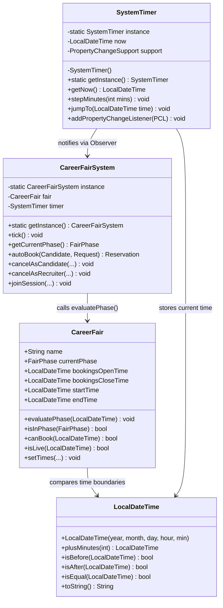
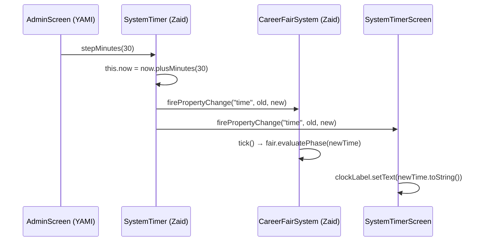
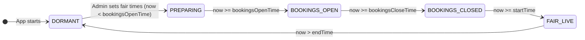
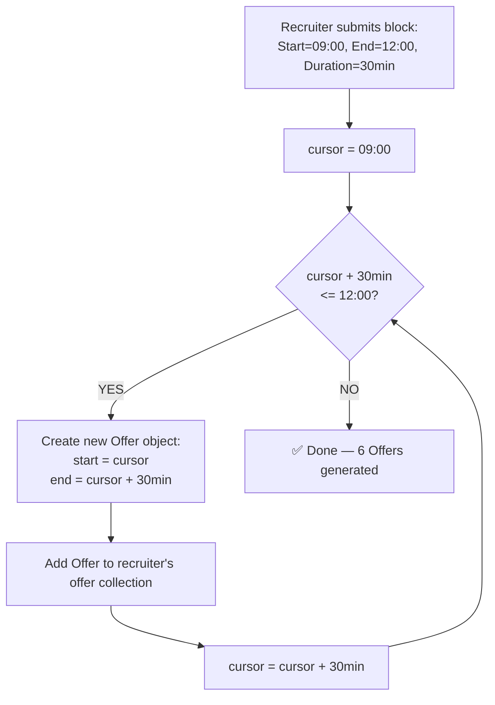
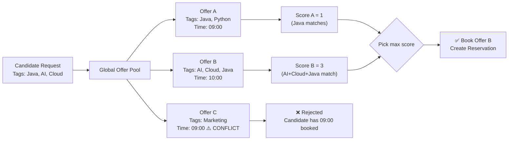

# Zaid's Personal Implementation Blueprint
## Project Manager | VCFS Group 9 | CSCU9P6

> This document is **exclusively for Zaid**. It covers only your 4 assigned Agile tickets:
> VCFS-001, VCFS-002, VCFS-003, and VCFS-004.
> Every step is linked directly to the actual skeleton files in `src/main/java/vcfs/core/`.

---

## Overview: What Zaid Owns

```
src/main/java/vcfs/
└── core/
    ├── LocalDateTime.java       ← VCFS-001 (Time wrapper)
    ├── SystemTimer.java         ← VCFS-001 (Singleton Observer clock)
    ├── CareerFair.java          ← VCFS-002 (State Machine)
    └── CareerFairSystem.java    ← VCFS-003 + VCFS-004 (Algorithms)
```

Your four tickets form the absolute foundation of VCFS.
**If your code is wrong, the entire system breaks.** Your team's UI cannot function without these working correctly.

---

## Architecture Overview: How Your 4 Files Relate



---

# TICKET VCFS-001
## Implement Singleton SystemTimer with Observer Pattern

### Why This Matters
The Admin UI will have a button: `"Advance Time by 30 mins"`. When clicked, **every single part** of the app needs to know — the lobby gatekeeper checks if sessions started, the phase evaluator checks if bookings opened. Without the Observer pattern, you would have to manually poke every class, which is a nightmare. 

The Observer pattern means SystemTimer automatically **broadcasts** that time changed, and any listener (the UI, the CareerFairSystem phase checker) will automatically respond.

---

### What the Current Skeleton Has
**File: `src/main/java/vcfs/core/SystemTimer.java`**
```java
package vcfs.core;

public class SystemTimer {

    LocalDateTime now;

    LocalDateTime getNow() {
        return this.now;
    }

    void stepMinutes(int mins) {
        // TODO - implement SystemTimer.stepMinutes
        throw new UnsupportedOperationException();
    }

    void jumpTo(LocalDateTime time) {
        // TODO - implement SystemTimer.jumpTo
        throw new UnsupportedOperationException();
    }
}
```
**Problems right now:**
- No Singleton (anyone can create multiple clocks — chaos!)
- No Observer (changes to time are silent — UI never updates)
- No initial time (clock starts null — NullPointerException guaranteed)

---

### Step 1.1 — Implement `LocalDateTime.java` as a Time Wrapper

**File: `src/main/java/vcfs/core/LocalDateTime.java`**

The skeleton is completely empty. Since Java already has `java.time.LocalDateTime`, your job is to either wrap it or replace the class with a full working implementation. The cleanest professional approach is to **wrap the real Java class**:

```java
package vcfs.core;

/**
 * VCFS Time Wrapper.
 * Wraps java.time.LocalDateTime for simulated time control.
 * 
 * Implemented by: Zaid (VCFS-001)
 */
public class LocalDateTime {

    private final java.time.LocalDateTime inner;

    // Constructor for any date-time
    public LocalDateTime(int year, int month, int day, int hour, int minute) {
        this.inner = java.time.LocalDateTime.of(year, month, day, hour, minute);
    }

    // Private constructor used internally
    private LocalDateTime(java.time.LocalDateTime inner) {
        this.inner = inner;
    }

    /** Return a new LocalDateTime advanced by the given minutes */
    public LocalDateTime plusMinutes(long mins) {
        return new LocalDateTime(this.inner.plusMinutes(mins));
    }

    /** True if this time is strictly before other */
    public boolean isBefore(LocalDateTime other) {
        return this.inner.isBefore(other.inner);
    }

    /** True if this time is strictly after other */
    public boolean isAfter(LocalDateTime other) {
        return this.inner.isAfter(other.inner);
    }

    /** True if exact same instant */
    public boolean isEqual(LocalDateTime other) {
        return this.inner.isEqual(other.inner);
    }

    /** Calculate difference in minutes between this and another time */
    public long minutesUntil(LocalDateTime other) {
        return java.time.Duration.between(this.inner, other.inner).toMinutes();
    }

    /** Human readable format for UI display */
    @Override
    public String toString() {
        return this.inner.format(java.time.format.DateTimeFormatter.ofPattern("yyyy-MM-dd HH:mm"));
    }
}
```

**Why these specific methods?**
- `plusMinutes` → SystemTimer calls this every tick
- `isBefore` / `isAfter` / `isEqual` → CareerFair calls these to evaluate phase transitions
- `minutesUntil` → Lobby Gatekeeper (MJAMishkat) calculates if a candidate joined too early
- `toString` → The Swing UI displays the time in the JLabel clock

---

### Step 1.2 — Convert SystemTimer to Singleton + Observer

**File: `src/main/java/vcfs/core/SystemTimer.java`**

**Full completed implementation:**

```java
package vcfs.core;

import java.beans.PropertyChangeListener;
import java.beans.PropertyChangeSupport;

/**
 * SINGLETON: Only one clock exists across the whole application.
 * OBSERVER: UI components register as listeners. When time advances,
 * all listeners are automatically notified with the new time.
 *
 * Implemented by: Zaid (VCFS-001)
 */
public class SystemTimer {

    // --- Singleton ---
    private static SystemTimer instance;

    // --- State ---
    private LocalDateTime now;

    // --- Observer engine (Java built-in, no external library needed) ---
    private final PropertyChangeSupport support = new PropertyChangeSupport(this);

    /** Private constructor — no one can call 'new SystemTimer()' */
    private SystemTimer() {
        // Set a default start time: e.g. 2026-04-01 at 08:00
        this.now = new LocalDateTime(2026, 4, 1, 8, 0);
    }

    /**
     * The only way to get the timer.
     * Thread-safe via 'synchronized' keyword.
     */
    public static synchronized SystemTimer getInstance() {
        if (instance == null) {
            instance = new SystemTimer();
        }
        return instance;
    }

    // ===== Implemented Methods =====

    /** Return the current simulated time */
    public LocalDateTime getNow() {
        return this.now;
    }

    /**
     * VCFS-001: Advance simulated clock by given minutes.
     * After advancing, fires a PropertyChangeEvent named "time"
     * so all subscribed UI components automatically refresh.
     *
     * @param mins Number of minutes to advance
     */
    public void stepMinutes(int mins) {
        LocalDateTime oldTime = this.now;
        this.now = this.now.plusMinutes(mins);

        // Broadcast to all registered observers (UI screens, CareerFairSystem)
        support.firePropertyChange("time", oldTime, this.now);
    }

    /**
     * VCFS-001: Jump directly to a specific time.
     * Also fires the Observer event so UI updates instantly.
     *
     * @param time The target LocalDateTime to jump to
     */
    public void jumpTo(LocalDateTime time) {
        LocalDateTime oldTime = this.now;
        this.now = time;
        support.firePropertyChange("time", oldTime, this.now);
    }

    /**
     * Register a listener that reacts whenever time changes.
     * The UI screens (AdminScreen, etc.) call this at startup.
     *
     * @param pcl Any class implementing PropertyChangeListener
     */
    public void addPropertyChangeListener(PropertyChangeListener pcl) {
        support.addPropertyChangeListener(pcl);
    }
}
```

### How the Observer Event Flow Works (Diagram)



**Key insight**: The Admin Screen (YAMI's code) simply calls `SystemTimer.getInstance().stepMinutes(30)`. Your SystemTimer then does ALL the heavy lifting automatically by broadcasting to everyone registered as a listener.

---

# TICKET VCFS-002
## Build State Machine: Dormant → Preparing → BookingsOpen → BookingsClosed → FairLive

### Why This Matters
The State Machine controls **what operations are allowed** at any given moment:
- During `PREPARING`: No one can book yet
- During `BOOKINGS_OPEN`: Candidates can create reservations
- During `FAIR_LIVE`: Candidates can join virtual rooms
- During `DORMANT`: Everything is locked

Without this, the system has no concept of "it's too early" or "the fair ended."

---

### The State Machine Visual



---

### What the Current Skeleton Has
**File: `src/main/java/vcfs/core/CareerFair.java`**
```java
package vcfs.core;

import java.util.*;

public class CareerFair {
    CareerFairSystem system;
    String name;
    FairPhase currentPhase;

    boolean isInPhase(FairPhase phase) {
        // TODO - implement CareerFair.isInPhase
        throw new UnsupportedOperationException();
    }

    boolean canBook(LocalDateTime now) {
        // TODO - implement CareerFair.canBook
        throw new UnsupportedOperationException();
    }

    boolean isLive(LocalDateTime now) {
        // TODO - implement CareerFair.isLive
        throw new UnsupportedOperationException();
    }
}
```
**Missing**: No time boundary fields. No phase evaluator method.

---

### Step 2.1 — Add Time Boundary Fields to CareerFair

These are the four timestamp pillars that define every phase transition:

```
[----PREPARING----][--BOOKINGS_OPEN--][--BOOKINGS_CLOSED--][---FAIR_LIVE---]
^                  ^                  ^                     ^               ^
App Init      bookingsOpenTime  bookingsCloseTime       startTime       endTime
```

---

### Step 2.2 — Full `CareerFair.java` Implementation

```java
package vcfs.core;

import vcfs.models.enums.FairPhase;

/**
 * Aggregate root for a single career fair run.
 * Stores timeline boundaries and controls phase transitions.
 *
 * Implemented by: Zaid (VCFS-002)
 */
public class CareerFair {

    // Reference to the owning system (injected on construction)
    CareerFairSystem system;

    // Fair identity
    String name;

    // Current phase — starts DORMANT
    FairPhase currentPhase = FairPhase.DORMANT;

    // === The 4 critical time boundaries ===
    LocalDateTime bookingsOpenTime;   // When candidates can start booking
    LocalDateTime bookingsCloseTime;  // When booking window ends
    LocalDateTime startTime;          // When the live fair begins (rooms open)
    LocalDateTime endTime;            // When the fair is completely over

    // ===== VCFS-007 (YAMI calls this from AdminController) =====
    /**
     * Admin sets the 4 time boundaries from the UI.
     * Validates chronological order to prevent accidental misconfiguration.
     */
    public void setTimes(LocalDateTime bookingsOpen, LocalDateTime bookingsClose,
                         LocalDateTime start, LocalDateTime end) {
        // Validate chronological order
        if (!bookingsOpen.isBefore(bookingsClose))
            throw new IllegalArgumentException("Bookings must open before they close.");
        if (!bookingsClose.isBefore(start))
            throw new IllegalArgumentException("Bookings must close before the fair starts.");
        if (!start.isBefore(end))
            throw new IllegalArgumentException("Fair start must be before fair end.");

        this.bookingsOpenTime  = bookingsOpen;
        this.bookingsCloseTime = bookingsClose;
        this.startTime         = start;
        this.endTime           = end;

        System.out.println("[CareerFair] Times configured. Fair: " + name);
    }

    // ===== VCFS-002: The Core Phase Evaluator =====
    /**
     * Called every time SystemTimer fires a "time" event (via CareerFairSystem.tick()).
     * Compares 'now' against the 4 boundaries and sets currentPhase accordingly.
     */
    public void evaluatePhase(LocalDateTime now) {

        // Guard: if times haven't been set yet, stay DORMANT
        if (bookingsOpenTime == null) {
            currentPhase = FairPhase.DORMANT;
            return;
        }

        if (now.isBefore(bookingsOpenTime)) {
            // We have times set but it's not yet open for bookings
            currentPhase = FairPhase.PREPARING;

        } else if ((now.isEqual(bookingsOpenTime) || now.isAfter(bookingsOpenTime))
                && now.isBefore(bookingsCloseTime)) {
            // Booking window is open
            currentPhase = FairPhase.BOOKINGS_OPEN;

        } else if ((now.isEqual(bookingsCloseTime) || now.isAfter(bookingsCloseTime))
                && now.isBefore(startTime)) {
            // Booking window closed — fair hasn't started yet
            currentPhase = FairPhase.BOOKINGS_CLOSED;

        } else if ((now.isEqual(startTime) || now.isAfter(startTime))
                && (now.isBefore(endTime) || now.isEqual(endTime))) {
            // Fair is actively live — virtual rooms open
            currentPhase = FairPhase.FAIR_LIVE;

        } else {
            // Past the endTime — fair is completely over
            currentPhase = FairPhase.DORMANT;
        }
    }

    // ===== Boolean Guard Methods =====

    /** True if currentPhase exactly matches the provided phase */
    public boolean isInPhase(FairPhase phase) {
        return this.currentPhase == phase;
    }

    /**
     * True ONLY during BOOKINGS_OPEN phase.
     * Called before every booking action to enforce rules.
     */
    public boolean canBook(LocalDateTime now) {
        evaluatePhase(now);
        return isInPhase(FairPhase.BOOKINGS_OPEN);
    }

    /**
     * True ONLY during FAIR_LIVE phase.
     * Called by Lobby Gatekeeper before allowing room entry.
     */
    public boolean isLive(LocalDateTime now) {
        evaluatePhase(now);
        return isInPhase(FairPhase.FAIR_LIVE);
    }

    /** Get the current phase without re-evaluating */
    public FairPhase getCurrentPhase() {
        return currentPhase;
    }
}
```

---

### Step 2.3 — Wire CareerFairSystem as an Observer of SystemTimer

**File: `src/main/java/vcfs/core/CareerFairSystem.java`**

This is the critical glue. `CareerFairSystem` must implement `PropertyChangeListener` so it automatically reacts to every clock tick:

```java
// Add this to the TOP of CareerFairSystem.java:
import java.beans.PropertyChangeEvent;
import java.beans.PropertyChangeListener;

public class CareerFairSystem implements PropertyChangeListener {

    private CareerFair fair;
    private static CareerFairSystem instance;

    private CareerFairSystem() {
        this.fair = new CareerFair();
        // Register self as Observer of the SystemTimer
        SystemTimer.getInstance().addPropertyChangeListener(this);
    }

    public static synchronized CareerFairSystem getInstance() {
        if (instance == null) instance = new CareerFairSystem();
        return instance;
    }

    /**
     * VCFS-002: Called automatically EVERY time SystemTimer advances.
     * This is the heartbeat of the whole system.
     */
    @Override
    public void propertyChange(PropertyChangeEvent evt) {
        if ("time".equals(evt.getPropertyName())) {
            tick(); // Triggered by the clock — evaluate phase
        }
    }

    /**
     * Advance time-based behaviour: phase transitions and session start/end.
     * Called automatically via Observer, not manually.
     */
    void tick() {
        LocalDateTime now = SystemTimer.getInstance().getNow();
        fair.evaluatePhase(now);
        FairPhase current = fair.getCurrentPhase();
        System.out.println("[SYSTEM TICK] Time: " + now + " | Phase: " + current);
    }

    FairPhase getCurrentPhase() {
        return fair.getCurrentPhase();
    }
    // ... rest of methods below ...
}
```

---

# TICKET VCFS-003
## Develop Availability Parser: Continuous Block → Discrete Offer Slots

### Why This Matters
A recruiter says: **"I am free from 09:00 to 12:00, each meeting is 30 minutes."** That is not one booking — that is **6 discrete offers** (09:00–09:30, 09:30–10:00, ..., 11:30–12:00). 

Without the parser, you'd have to manually create 6 `Offer` objects which is horrible UX and breaks the entire booking model.

---

### The Parsing Algorithm Visualized



---

### What the Current Skeleton Has

**`Offer.java`** currently has:
- `Recruiter publisher`
- `Collection<Reservation> reservations`
- `int durationMins`
- `getDurationMins()` → returns `this.durationMins`
- `updateDetails()` → TODO (not Zaid's job)

**Missing fields Zaid must add:**
- `LocalDateTime startTime` — when this offer slot begins
- `LocalDateTime endTime` — when this offer slot ends
- `String topicTags` — for MatchEngine to score against
- `int capacity` — max candidates

---

### Step 3.1 — Add Fields to Offer.java

```java
// ===== FIELDS TO ADD to Offer.java =====
// (Inside the class body, alongside existing fields)

LocalDateTime startTime;    // When this specific slot begins
LocalDateTime endTime;      // When this slot ends
String topicTags;           // Comma-separated: "AI,Java,Cloud"
int capacity;               // Max attendees (usually 1 for 1-on-1)
String title;               // Display name of the offer
```

---

### Step 3.2 — Implement Availability Parser in CareerFairSystem

```java
// ===== INSIDE CareerFairSystem.java =====

/**
 * VCFS-003: Availability Parser Algorithm.
 * Takes a continuous time block and chunks it into discrete Offer slots.
 *
 * @param recruiter   The recruiter publishing slots
 * @param title       Name of the session
 * @param durationMins Length of each individual slot in minutes
 * @param topicTags   Comma-separated skill tags e.g. "Java,AI,Cloud"
 * @param capacity    Max candidates per slot (usually 1)
 * @param blockStart  When the recruiter's availability window begins
 * @param blockEnd    When the recruiter's availability window ends
 * @return            Number of slots generated
 */
public int parseAvailabilityIntoOffers(Recruiter recruiter, String title,
        int durationMins, String topicTags, int capacity,
        LocalDateTime blockStart, LocalDateTime blockEnd) {

    // Validate: only during BOOKINGS_OPEN phase
    if (!fair.canBook(SystemTimer.getInstance().getNow())) {
        throw new IllegalStateException("Cannot publish offers outside the booking window.");
    }

    // Validate: block must be at least one slot long
    if (blockStart.minutesUntil(blockEnd) < durationMins) {
        throw new IllegalArgumentException("Availability block is shorter than the slot duration.");
    }

    LocalDateTime cursor = blockStart;
    int slotsCreated = 0;

    // CORE LOOP: keep creating slots until cursor + duration overshoots blockEnd
    while (!cursor.plusMinutes(durationMins).isAfter(blockEnd)) {

        // Build the discrete Offer object
        Offer slot = new Offer();
        slot.title        = title;
        slot.startTime    = cursor;
        slot.endTime      = cursor.plusMinutes(durationMins);
        slot.durationMins = durationMins;
        slot.topicTags    = topicTags;
        slot.capacity     = capacity;
        slot.publisher    = recruiter;
        slot.reservations = new ArrayList<>();

        // Add to recruiter's personal offer collection
        recruiter.offers.add(slot);

        // Advance cursor
        cursor = cursor.plusMinutes(durationMins);
        slotsCreated++;

        System.out.println("[PARSER] Created slot: " + slot.startTime + " → " + slot.endTime);
    }

    System.out.println("[PARSER] Total slots generated: " + slotsCreated);
    return slotsCreated;
}
```

---

# TICKET VCFS-004
## Build Tag-Weighted MatchEngine for Auto-Booking

### Why This Matters
A candidate clicks "Auto Book Me". The system must:
1. Look at every available `Offer` globally
2. Skip offers that clash with existing reservations (Collision Detection)
3. Score each valid offer based on how many tags match
4. Create a `Reservation` linking candidate → best offer

This is the most complex algorithm you write. It combines data structures (HashMap), string parsing, and conditional logic.

---

### The MatchEngine Scoring System



---

### Step 4.1 — Full MatchEngine Implementation in CareerFairSystem

```java
// ===== INSIDE CareerFairSystem.java =====

import java.util.*;

/**
 * VCFS-004: Tag-Weighted MatchEngine.
 * Automatically finds and books the best matching offer for a candidate.
 *
 * @param candidate  The candidate requesting auto-booking
 * @param request    Contains desiredTags and preferredOrgs
 * @return           The created Reservation, or null if no match found
 */
Reservation autoBook(Candidate candidate, Request request) {

    // === PHASE GUARD ===
    if (!fair.canBook(SystemTimer.getInstance().getNow())) {
        System.out.println("[AUTOBOOK] Rejected — not in BOOKINGS_OPEN phase.");
        return null;
    }

    // === STEP 1: Parse desired tags from comma-separated string ===
    List<String> desiredTags = Arrays.asList(
        request.desiredTags.toLowerCase().split(",\\s*")
    );
    System.out.println("[AUTOBOOK] Candidate: " + candidate.displayName
                       + " | Desired: " + desiredTags);

    // === STEP 2: Build score map across ALL offers in the system ===
    Map<Offer, Integer> scoreMap = new HashMap<>();

    for (Offer offer : getAllOffers()) { // getAllOffers() collects from every Booth/Recruiter

        // --- COLLISION DETECTION ---
        // Check if candidate already has a reservation overlapping this offer's time
        boolean conflict = false;
        for (Reservation existing : candidate.reservations) {
            // Conflict if scheduled times overlap
            if (existing.scheduledStart.isEqual(offer.startTime) ||
               (existing.scheduledStart.isBefore(offer.endTime) &&
                existing.scheduledEnd.isAfter(offer.startTime))) {
                conflict = true;
                System.out.println("[AUTOBOOK] CONFLICT detected at: " + offer.startTime);
                break;
            }
        }
        if (conflict) continue; // Skip this offer entirely

        // --- TAG SCORING ---
        List<String> offerTags = Arrays.asList(
            offer.topicTags.toLowerCase().split(",\\s*")
        );

        int score = 0;
        for (String desired : desiredTags) {
            if (offerTags.contains(desired.trim())) {
                score++;
            }
        }

        // Only consider offers with at least 1 matching tag
        if (score > 0) {
            scoreMap.put(offer, score);
            System.out.println("[AUTOBOOK] Offer at " + offer.startTime
                               + " | Tags: " + offerTags + " | Score: " + score);
        }
    }

    // === STEP 3: Select the highest-scoring offer ===
    if (scoreMap.isEmpty()) {
        System.out.println("[AUTOBOOK] No matching offers found for " + candidate.displayName);
        return null;
    }

    Offer bestOffer = Collections.max(
        scoreMap.entrySet(),
        Map.Entry.comparingByValue()
    ).getKey();

    System.out.println("[AUTOBOOK] Best match: " + bestOffer.startTime
                       + " (score=" + scoreMap.get(bestOffer) + ")");

    // === STEP 4: Create and register the Reservation ===
    Reservation reservation = new Reservation();
    reservation.candidate       = candidate;
    reservation.offer           = bestOffer;
    reservation.scheduledStart  = bestOffer.startTime;
    reservation.scheduledEnd    = bestOffer.endTime;
    reservation.state           = ReservationState.CONFIRMED;

    // Link into both candidate and offer
    candidate.reservations.add(reservation);
    bestOffer.reservations.add(reservation);

    System.out.println("[AUTOBOOK] ✅ Reservation CONFIRMED: "
                       + candidate.displayName + " → " + bestOffer.startTime);

    return reservation;
}

/**
 * Utility: Gather ALL offers from ALL booths and ALL recruiters.
 * Used by MatchEngine and manual browsing.
 */
private List<Offer> getAllOffers() {
    List<Offer> allOffers = new ArrayList<>();
    // Iterate: Organization → Booth → Recruiter → Offer
    for (Organization org : fair.organizations) {
        for (Booth booth : org.booths) {
            for (Recruiter recruiter : booth.recruiters) {
                allOffers.addAll(recruiter.offers);
            }
        }
    }
    return allOffers;
}
```

---

## Final Summary: Your Exact Implementation Order

| Step | File | What You Write | Time Estimate |
|------|------|----------------|---------------|
| **1** | `LocalDateTime.java` | Full time wrapper (plusMinutes, isBefore, etc.) | ~30 mins |
| **2** | `SystemTimer.java` | Singleton + Observer firePropertyChange | ~45 mins |
| **3** | `CareerFairSystem.java` | Implements PropertyChangeListener, tick(), Singleton | ~30 mins |
| **4** | `CareerFair.java` | setTimes(), evaluatePhase(), canBook(), isLive() | ~1 hour |
| **5** | `Offer.java` | Add startTime, endTime, topicTags, capacity fields | ~15 mins |
| **6** | `CareerFairSystem.java` | parseAvailabilityIntoOffers() algorithm | ~1 hour |
| **7** | `CareerFairSystem.java` | autoBook() MatchEngine + getAllOffers() | ~1.5 hours |

**Total estimate: ~6 hours of focused coding**

> [!IMPORTANT]
> Do **Step 1 and 2 first** before any other team member writes a single line of UI code. Without `SystemTimer` and `LocalDateTime` working, nothing can compile.

---

**Document Version**: 1.0  
**Last Updated**: April 6, 2026  
**Assigned to**: Zaid (Project Manager)  
**Tickets Covered**: VCFS-001, VCFS-002, VCFS-003, VCFS-004
