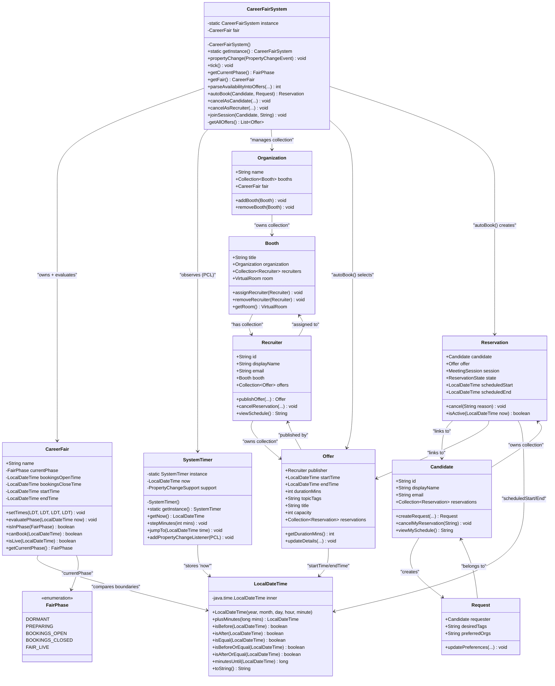
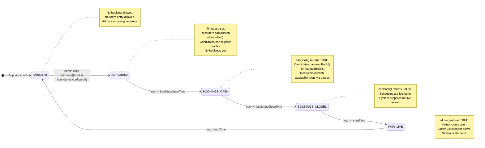
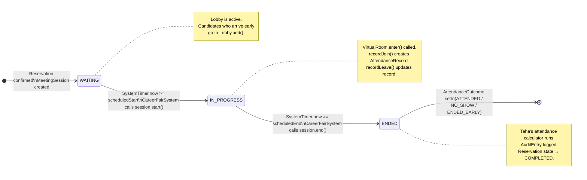
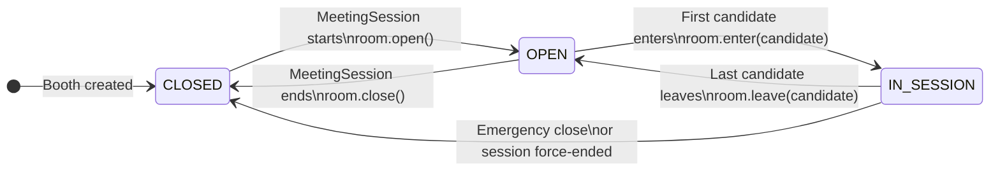
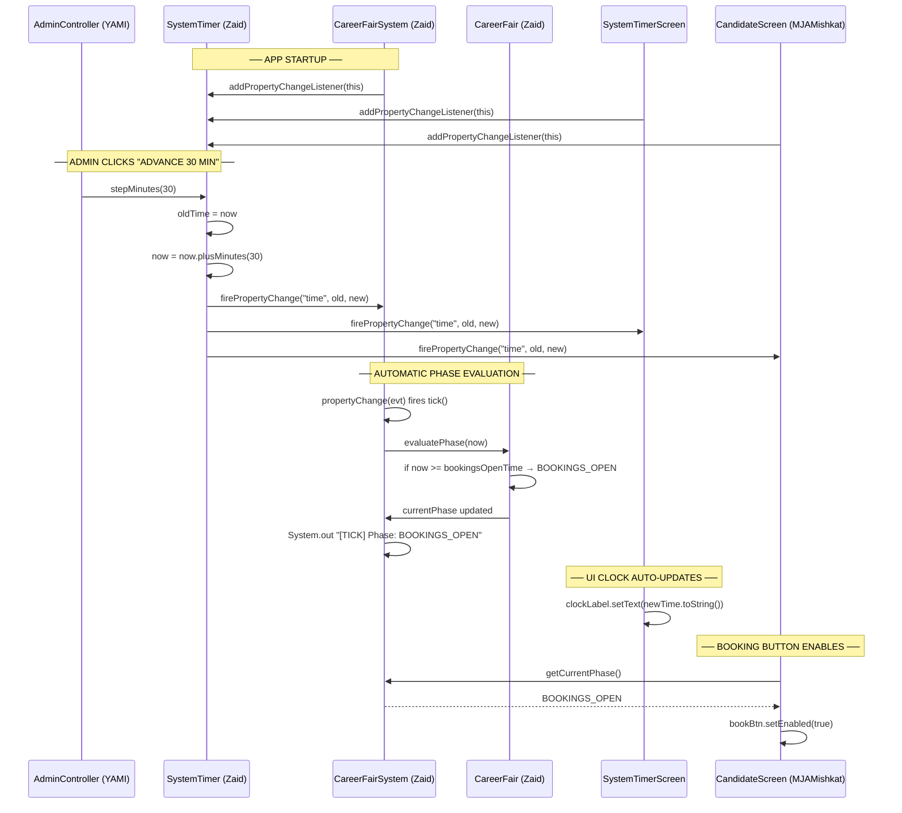
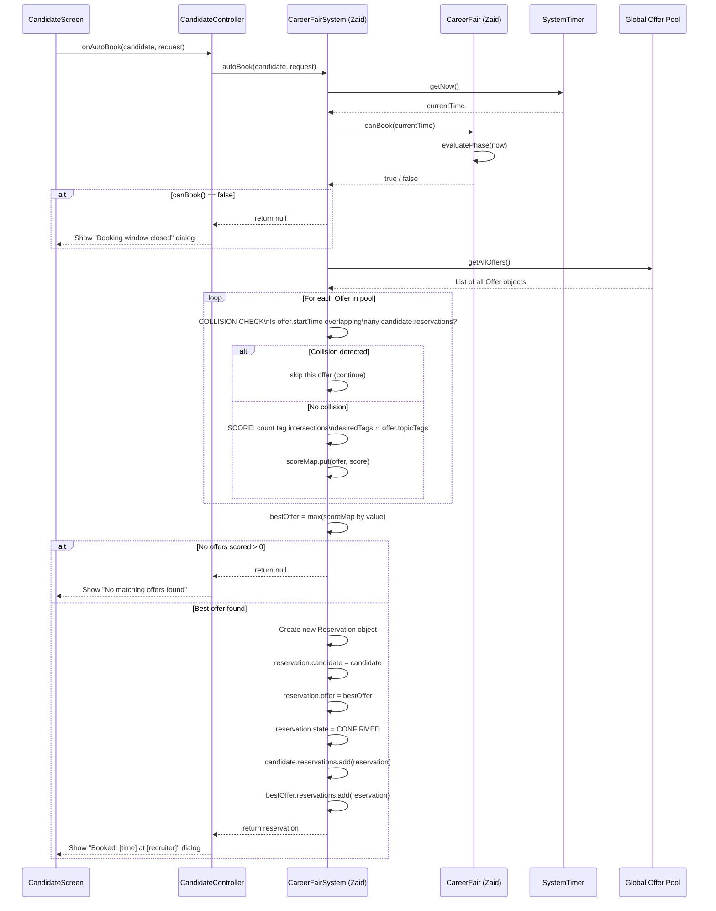
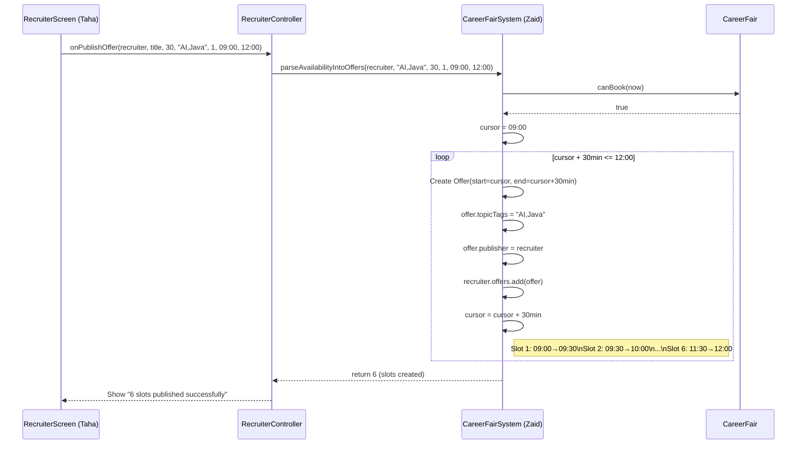
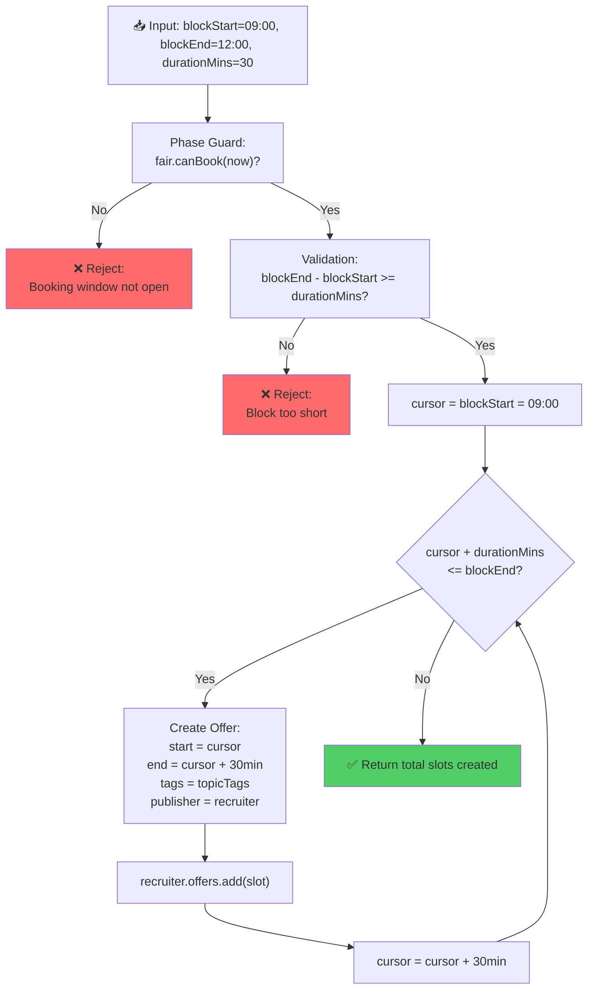
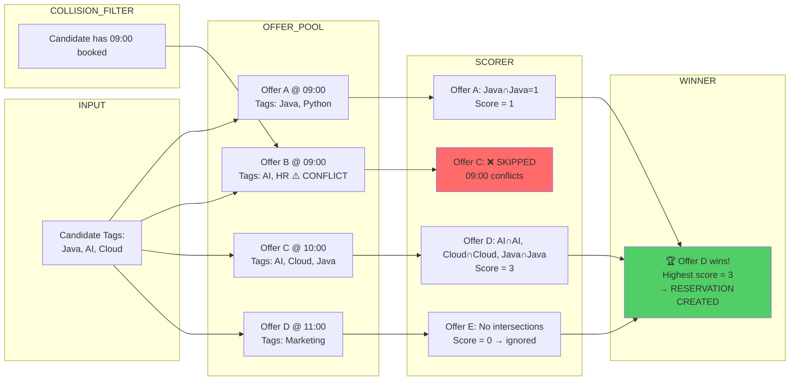

# Zaid's Personal Implementation Blueprint — Part 2 of 2
## Tickets: VCFS-003 & VCFS-004 + ALL Diagrams
### Project Manager | Group 9 | CSCU9P6

> This document is **exclusively for Zaid**. It covers VCFS-003 and VCFS-004
> and contains ALL architecture diagrams: Class, State Machine, Sequence, and Flowcharts.

---

# SECTION A: ALL DIAGRAMS

## Diagram 1 — Full System Class Diagram (Zaid's Files + Their Relationships)



---

## Diagram 2 — State Machine: FairPhase Transitions



---

## Diagram 3 — State Machine: MeetingSession Lifecycle



---

## Diagram 4 — State Machine: VirtualRoom States



---

## Diagram 5 — Sequence: Full Observer Tick Flow (VCFS-001 + VCFS-002)



---

## Diagram 6 — Sequence: autoBook() MatchEngine Full Flow (VCFS-004)



---

## Diagram 7 — Sequence: Availability Parser (VCFS-003)



---

# SECTION B: TICKET VCFS-003
## Availability Parser: Continuous Block → Discrete Offer Slots

### What Problem Are We Solving?

A recruiter says: **"I'm free from 09:00 to 12:00, each session is 30 minutes."**

Without a parser:
- Recruiter manually creates 6 Offer objects → tedious, error-prone
- Times could overlap → system breaks
- Can't scale to different durations

With the parser:
- Recruiter provides one simple block (start, end, duration)
- Parser automatically generates the exact correct number of non-overlapping slots
- Fully dynamic: works for 20-min slots, 45-min slots, any duration

---

### The Parser Flowchart



---

### Fields to Add to `Offer.java`

Open `src/main/java/vcfs/models/booking/Offer.java` and add these fields alongside the existing ones:

```java
// === ADD THESE FIELDS to Offer.java ===
// (Zaid adds these to support the Availability Parser)

/** When this specific appointment slot begins */
LocalDateTime startTime;

/** When this specific appointment slot ends */
LocalDateTime endTime;

/** Display name for this offer type */
String title;

/** Comma-separated skill tags. e.g. "AI,Java,Cloud,ML" */
String topicTags;

/** Max candidates per slot (usually 1 for 1-on-1 meetings) */
int capacity;
```

---

### Full Parser Implementation (in `CareerFairSystem.java`)

```java
/**
 * ============================================================
 * VCFS-003: Availability Parser Algorithm
 * ============================================================
 * Converts a recruiter's continuous free-time block into a
 * collection of discrete, bookable Offer slot objects.
 *
 * Example:
 *   Input:  blockStart=09:00, blockEnd=12:00, durationMins=30
 *   Output: 6 Offer objects created:
 *           09:00→09:30, 09:30→10:00, 10:00→10:30,
 *           10:30→11:00, 11:00→11:30, 11:30→12:00
 *
 * @param recruiter    The Recruiter publishing their availability
 * @param title        Session title (e.g. "Software Engineer Chat")
 * @param durationMins Length of each individual slot in minutes
 * @param topicTags    Comma-separated skill tags for MatchEngine scoring
 * @param capacity     Max candidates per slot (typically 1)
 * @param blockStart   Start of the recruiter's availability window
 * @param blockEnd     End of the recruiter's availability window
 * @return             Number of discrete slots successfully generated
 *
 * Implemented by: Zaid (VCFS-003)
 * ============================================================
 */
public int parseAvailabilityIntoOffers(
        Recruiter recruiter,
        String title,
        int durationMins,
        String topicTags,
        int capacity,
        LocalDateTime blockStart,
        LocalDateTime blockEnd) {

    // === GUARD 1: Phase check — recruiters can only publish during BOOKINGS_OPEN ===
    if (!fair.canBook(SystemTimer.getInstance().getNow())) {
        System.out.println("[PARSER] ❌ Rejected — not in BOOKINGS_OPEN phase.");
        throw new IllegalStateException(
            "Cannot publish offers outside the booking window. "
            + "Current phase: " + fair.getCurrentPhase());
    }

    // === GUARD 2: The block must be long enough for at least one slot ===
    long blockDuration = blockStart.minutesUntil(blockEnd);
    if (blockDuration < durationMins) {
        throw new IllegalArgumentException(
            "[PARSER] ❌ Block too short. Block=" + blockDuration
            + "min, Slot=" + durationMins + "min");
    }

    // === GUARD 3: Validate recruiter object ===
    if (recruiter == null || recruiter.offers == null) {
        throw new IllegalArgumentException("[PARSER] ❌ Invalid recruiter provided.");
    }

    // === MAIN PARSING LOOP ===
    LocalDateTime cursor = blockStart;
    int slotsCreated = 0;

    System.out.println("[PARSER] Starting parse for '"
                       + recruiter.displayName + "'");
    System.out.println("[PARSER] Block: " + blockStart + " → " + blockEnd
                       + " | SlotDuration: " + durationMins + "min");

    while (!cursor.plusMinutes(durationMins).isAfter(blockEnd)) {

        // === Create the discrete Offer slot ===
        Offer slot = new Offer();
        slot.title        = title;
        slot.startTime    = cursor;
        slot.endTime      = cursor.plusMinutes(durationMins);
        slot.durationMins = durationMins;
        slot.topicTags    = topicTags;
        slot.capacity     = capacity;
        slot.publisher    = recruiter;
        slot.reservations = new java.util.ArrayList<>();

        // === Register the slot with the recruiter ===
        recruiter.offers.add(slot);
        slotsCreated++;

        System.out.println("[PARSER] ✅ Slot " + slotsCreated + ": "
                           + slot.startTime + " → " + slot.endTime);

        // === Advance cursor by one slot duration ===
        cursor = cursor.plusMinutes(durationMins);
    }

    System.out.println("[PARSER] Complete: " + slotsCreated
                       + " slots published for " + recruiter.displayName);
    return slotsCreated;
}
```

---

# SECTION C: TICKET VCFS-004
## Tag-Weighted MatchEngine for Auto-Booking

### What Problem Are We Solving?

A candidate clicks "Find me the best appointment." The system must:
1. Look at every recruiter's every offer globally
2. Throw away offers that would double-book the candidate (collision detection)
3. Score remaining offers based on how well the tags match
4. Book the highest-scoring offer automatically

This is a **recommendation engine** built from scratch in pure Java.

---

### The Scoring Algorithm Visualized



---

### Collision Detection Deep Dive

Collision detection is the trickiest part. Two reservations conflict if their time windows **overlap**. There are 3 possible overlap cases:

```
Case 1 — Exact same start:
  Existing:  [09:00 ──────── 09:30]
  New offer: [09:00 ──────── 09:30]
  → CONFLICT ❌

Case 2 — New offer starts inside existing:
  Existing:  [09:00 ──────── 09:30]
  New offer:       [09:15 ──────── 09:45]
  → CONFLICT ❌

Case 3 — New offer ends inside existing:
  Existing:       [09:15 ──────── 09:45]
  New offer: [09:00 ──────── 09:30]
  → CONFLICT ❌

Case 4 — No overlap (safe):
  Existing:  [09:00 ──── 09:30]
  New offer:              [09:30 ──── 10:00]
  → SAFE ✅
```

The mathematical formula for overlap: Two intervals `[A_start, A_end]` and `[B_start, B_end]` overlap if and only if `A_start < B_end AND B_start < A_end`.

---

### Full MatchEngine Implementation (in `CareerFairSystem.java`)

```java
/**
 * ============================================================
 * VCFS-004: Tag-Weighted MatchEngine
 * ============================================================
 * Automatically finds and confirms the highest-scoring
 * Offer for a given Candidate, preventing schedule conflicts.
 *
 * Algorithm Summary:
 *   1. Validate phase (BOOKINGS_OPEN required)
 *   2. Parse candidate's desired tags from Request
 *   3. For each global Offer:
 *      a. Run Collision Detection — skip if time conflict exists
 *      b. Calculate Tag Intersection Score
 *      c. Store in HashMap<Offer, Integer>
 *   4. Select Offer with maximum score from HashMap
 *   5. Create and return a confirmed Reservation
 *
 * @param candidate  The candidate requesting auto-booking
 * @param request    Contains desiredTags and preferredOrgs
 * @return           Confirmed Reservation, or null if no match found
 *
 * Implemented by: Zaid (VCFS-004)
 * ============================================================
 */
Reservation autoBook(Candidate candidate, Request request) {

    // === GUARD 1: Phase must be BOOKINGS_OPEN ===
    LocalDateTime now = SystemTimer.getInstance().getNow();
    if (!fair.canBook(now)) {
        System.out.println("[MATCHENGINE] ❌ Booking rejected — Phase: "
                           + fair.getCurrentPhase());
        return null;
    }

    // === GUARD 2: Validate inputs ===
    if (candidate == null || request == null || request.desiredTags == null) {
        throw new IllegalArgumentException("[MATCHENGINE] ❌ Invalid candidate or request.");
    }

    // === STEP 1: Parse desired tags into a List for comparison ===
    // Split "Java, AI, Cloud" → ["java", "ai", "cloud"] (lowercase for fair comparison)
    java.util.List<String> desiredTags = java.util.Arrays.asList(
        request.desiredTags.toLowerCase().split(",\\s*")
    );

    System.out.println("[MATCHENGINE] Auto-booking for: " + candidate.displayName);
    System.out.println("[MATCHENGINE] Desired tags: " + desiredTags);

    // === STEP 2: Initialize the score map ===
    java.util.Map<Offer, Integer> scoreMap = new java.util.HashMap<>();

    // === STEP 3: Evaluate every offer in the system ===
    for (Offer offer : getAllOffers()) {

        // Skip offers with no topic tags (shouldn't happen but defensive)
        if (offer.topicTags == null || offer.startTime == null) continue;

        // --- COLLISION DETECTION ---
        // Check if candidate already has a reservation that overlaps this offer's time
        boolean conflict = false;
        for (Reservation existing : candidate.reservations) {
            // Overlap condition: existing.start < offer.end AND offer.start < existing.end
            boolean overlaps =
                existing.scheduledStart.isBefore(offer.endTime) &&
                offer.startTime.isBefore(existing.scheduledEnd);

            if (overlaps) {
                conflict = true;
                System.out.println("[MATCHENGINE] ⚡ Collision at "
                    + offer.startTime + " — skipping.");
                break;
            }
        }
        if (conflict) continue; // Skip this offer — it conflicts

        // --- TAG INTERSECTION SCORING ---
        java.util.List<String> offerTags = java.util.Arrays.asList(
            offer.topicTags.toLowerCase().split(",\\s*")
        );

        int score = 0;
        for (String desired : desiredTags) {
            if (offerTags.contains(desired.trim())) {
                score++;
            }
        }

        // Only add to the map if there is at least 1 matching tag
        if (score > 0) {
            scoreMap.put(offer, score);
            System.out.println("[MATCHENGINE] 📊 Offer at " + offer.startTime
                + " | Tags: " + offerTags
                + " | Score: " + score + "/" + desiredTags.size());
        }
    }

    // === STEP 4: Select the winner ===
    if (scoreMap.isEmpty()) {
        System.out.println("[MATCHENGINE] ❌ No matching offers found.");
        return null;
    }

    // Collections.max returns the entry with the largest value
    Offer bestOffer = java.util.Collections.max(
        scoreMap.entrySet(),
        java.util.Map.Entry.comparingByValue()
    ).getKey();

    System.out.println("[MATCHENGINE] 🏆 Winner: " + bestOffer.startTime
        + " (score=" + scoreMap.get(bestOffer) + ")");

    // === STEP 5: Create and register the Reservation ===
    Reservation reservation = new Reservation();
    reservation.candidate      = candidate;
    reservation.offer          = bestOffer;
    reservation.scheduledStart = bestOffer.startTime;
    reservation.scheduledEnd   = bestOffer.endTime;
    reservation.state          = ReservationState.CONFIRMED;

    // Register on both sides of the relationship
    candidate.reservations.add(reservation);
    bestOffer.reservations.add(reservation);

    System.out.println("[MATCHENGINE] ✅ CONFIRMED: "
        + candidate.displayName + " → " + bestOffer.startTime
        + " with " + bestOffer.publisher.displayName);

    return reservation;
}

/**
 * Utility: Traverse the entire org → booth → recruiter → offer hierarchy
 * to collect ALL published Offer objects into a flat list.
 *
 * Used by: autoBook() MatchEngine
 * Used by: ManualBoook browsing (MJAMishkat's search)
 */
private java.util.List<Offer> getAllOffers() {
    java.util.List<Offer> allOffers = new java.util.ArrayList<>();
    if (fair.organizations == null) return allOffers;

    for (Organization org : fair.organizations) {
        if (org.booths == null) continue;
        for (Booth booth : org.booths) {
            if (booth.recruiters == null) continue;
            for (Recruiter recruiter : booth.recruiters) {
                if (recruiter.offers != null) {
                    allOffers.addAll(recruiter.offers);
                }
            }
        }
    }

    System.out.println("[getAllOffers] Total offers in system: " + allOffers.size());
    return allOffers;
}
```

---

# SECTION D: FINAL IMPLEMENTATION ORDER (Full Summary)

| Priority | File | Methods to Implement | Ticket |
|----------|------|----------------------|--------|
| 🔴 **1st** | `LocalDateTime.java` | Full class from scratch | VCFS-001 |
| 🔴 **2nd** | `SystemTimer.java` | Singleton + Observer | VCFS-001 |
| 🟡 **3rd** | `CareerFair.java` | setTimes, evaluatePhase, canBook, isLive | VCFS-002 |
| 🟡 **4th** | `CareerFairSystem.java` | Singleton + PropertyChangeListener + tick | VCFS-002 |
| 🟢 **5th** | `Offer.java` | Add startTime, endTime, title, topicTags, capacity fields | VCFS-003 |
| 🟢 **6th** | `CareerFairSystem.java` | parseAvailabilityIntoOffers() | VCFS-003 |
| 🔵 **7th** | `CareerFairSystem.java` | autoBook() + getAllOffers() | VCFS-004 |

**Total estimated time: ~6-8 hours of focused implementation**

---

## Critical Notes for Zaid

> [!IMPORTANT]
> **Do NOT touch** `AdminScreen.java`, `CandidateScreen.java`, `RecruiterScreen.java`, `Lobby.java`, `MeetingSession.java`, `VirtualRoom.java`, `AttendanceRecord.java`, or `AuditEntry.java`.
> Those belong to YAMI, Taha, and MJAMishkat respectively.
> Your role ends at the `core/` package and the fields/methods explicitly listed above.

---

**Document Version**: 1.0  
**Last Updated**: April 6, 2026  
**Assigned to**: Zaid (Project Manager)  
**Tickets Covered**: VCFS-003, VCFS-004 (Complete Diagrams & Algorithms)
